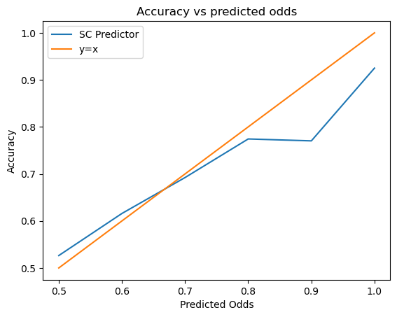
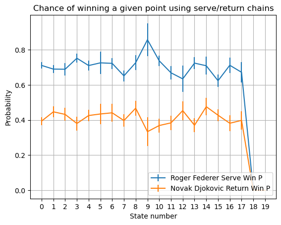
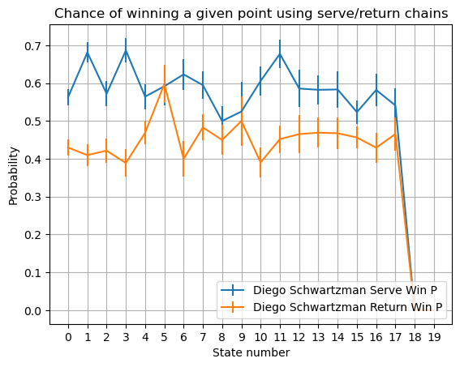

### Docs/Logs

#### First prediction run on the atp 2017 dataset
##### Uses only Server Chains (Alternates every game)
- Implemented in ServerChainSimulator and ServerChainPredictor
- Accuracy of 62.5%.

- How is my calculation of win probability related to the accuracy?

#### Implementation of Return Chains
- Required somewhat extensive rewrite of PlayerMC and Match, but the new infrastructure should be much easier to extend to various prediction methods in the future. 
    - In the new method, we have a Match base class that does little more than track names and player Markov Chains
    - The Match base class is inherited by ServerChainSimulator.
    - What used to be in the Match class is now in "simulator" classes that inherit from match.
    - Each simulator class must implement the following functions
        - simulate_point
        - simulate_game
        - simulate_set
        - simulate_match

    - The simulator class need not implement a statistical sampling function, but I'm still deciding if it makes the most sense for a predictor to implement that or if the simulator itself should implement that. 
        - I'm leaning towards implementing it on the predictor side, since a different predictor model might want to use a different type of sampling for that. For now, I've left a copy in the ServerChainSimulator class to keep backwards compatibility.

$~$
- Now that we have returner chains, let's inspect the probability of a server winning a point vs the probability of a returner winning it. Then we can compute the true probability of these things happening and see where the true probability lies in relation to the two curves (hopefully its in between them.)
- Here we have such a graph for Roger Federer serving against Novak Djokovic
    

    - I'm happy to see a nice stark difference in the lines, even with 1 SE error bars, RF on serve is still heavily favored against ND on return. 
    - I'm very surprised to see such a strong symmetry. It's entirely possible that this symmetry shows up because Roger and Novak may have played quite often in 2017, meaning the data in their chains are just complements of each other.

- That graph makes a lot of sense since Roger is a strong server. What about someone who isn't such a strong server but might return quite well? Here's a similar graph for Diego Schwartzman Serving against... himself.

    

    - It's interesting to compare the two graphs, and they seem to tell us what we should know from knowing the game of Roger Federer and Diego Schwartzman. Obviously, Roger serves much better than Diego, but we can see that diego wins a higher percentage of returning points than even Novak. 

- These graphs also give a bit of credibillity to the idea of using point-by-point Markov Chains for prediction of tennis matches, rather than a simple probability of winning a given game approach-- Players serve differently depending on what the score is. Serve win probability is clearly NOT independent of score.

- These graphs were generated in inspect_sc_rc.ipynb